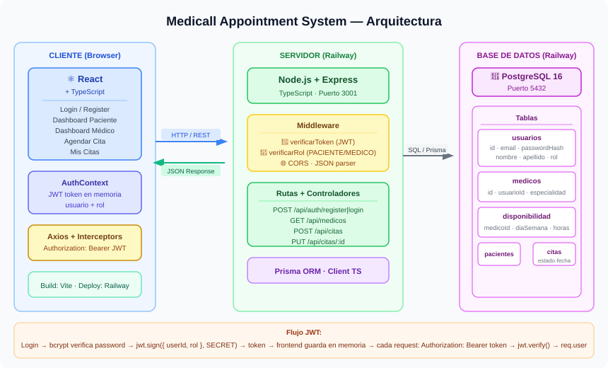
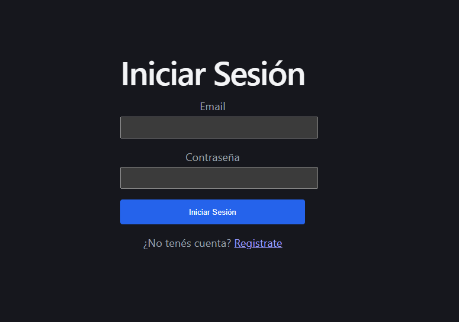
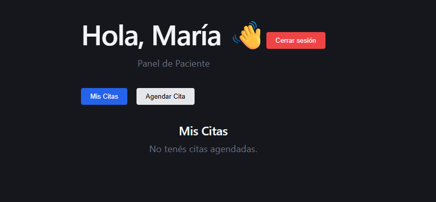
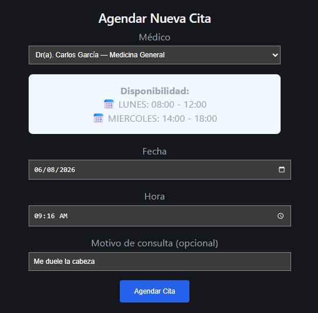
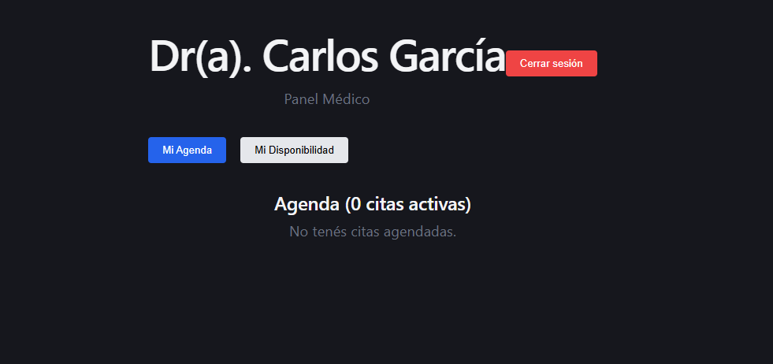
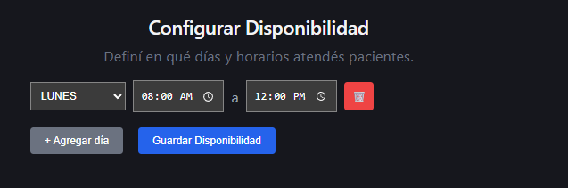

# 🏥 Medical Appointment System

> Sistema web de agendamiento médico con autenticación por roles, gestión de citas y disponibilidad configurable por médico.

🔗 **Demo en producción:** [Medical system](https://mas-frontend-production-1.up.railway.app)

---

## 📋 Descripción del problema que resuelve

En muchos consultorios y clínicas pequeñas, el proceso de agendar citas sigue siendo manual: llamadas telefónicas, agendas físicas y falta de visibilidad para el paciente sobre su historial. Esto genera:

- **Doble agendamiento** por errores de coordinación
- **Falta de transparencia** — el paciente no sabe si su cita fue confirmada
- **Carga administrativa** — el médico o recepcionista gestiona todo manualmente
- **Sin historial accesible** — el paciente no recuerda cuándo fue su última consulta

**Medicall** resuelve esto con una aplicación web donde:

| Actor        | Puede hacer                                                                                                         |
| ------------ | ------------------------------------------------------------------------------------------------------------------- |
| **Paciente** | Registrarse, ver médicos disponibles y sus horarios, agendar citas, ver su historial, cancelar citas                |
| **Médico**   | Configurar su disponibilidad semanal, ver su agenda del día, confirmar o cancelar citas, marcarlas como completadas |

El sistema valida automáticamente que la cita sea dentro del horario disponible del médico y que no haya conflicto con otras citas existentes.

---

## 🏗️ Diagrama de arquitectura



> _Para ver el diagrama interactivo en draw.io: abrí el archivo `docs/architecture.svg` desde https://app.diagrams.net_

**Stack:**

- **Frontend:** React 18 + TypeScript · Vite · React Router · Axios
- **Backend:** Node.js + Express + TypeScript
- **ORM:** Prisma (migraciones + tipos TypeScript automáticos)
- **Base de datos:** PostgreSQL 16
- **Autenticación:** JWT (jsonwebtoken + bcryptjs)
- **Deploy:** Railway (backend + frontend + PostgreSQL)

---

## 🖼️ Screenshots

### Login



### Dashboard Paciente — Mis Citas



### Dashboard Paciente — Agendar Cita



### Dashboard Médico — Agenda del día



### Dashboard Médico — Configurar Disponibilidad



---

## 🚀 Correr el proyecto localmente con Docker Compose

Esta es la forma más rápida — levanta backend, frontend y base de datos en un solo comando.

### Prerrequisitos

- [Docker Desktop](https://www.docker.com/products/docker-desktop) instalado y **corriendo** (verificá que el ícono esté en la barra de tareas)
- [Git](https://git-scm.com)

### Pasos

```bash
# 1. Clonar el repositorio
git clone https://github.com/ElizabethP15/medical-appointment-system.git
cd medical-appointment-system

# 2. Levantar todos los servicios
docker compose up --build
```

Eso es todo. Docker se encarga de instalar dependencias, compilar y migrar la base de datos.

| Servicio     | URL                              |
| ------------ | -------------------------------- |
| Frontend     | http://localhost                 |
| Backend API  | http://localhost:3001            |
| Health check | http://localhost:3001/api/health |

```bash
# Para detener:
docker compose down

# Para detener y borrar los datos de la BD:
docker compose down -v
```

---

## 🛠️ Correr en local SIN Docker (modo desarrollo)

Necesitás una instancia de PostgreSQL accesible (Railway, Neon.tech, o local).

### Prerrequisitos

- [Node.js 20+](https://nodejs.org)
- Una URL de PostgreSQL (podés usar la de Railway: ver sección Variables de entorno)

### Backend

```bash
cd backend

# Instalar dependencias
npm install

# Crear archivo de variables de entorno
cp .env
# Editá .env y completá DATABASE_URL con tu URL de PostgreSQL

# Ejecutar migraciones y generar el cliente Prisma
npx prisma migrate dev

# Iniciar en modo desarrollo (se recarga automáticamente al guardar)
npm run dev
# Servidor disponible en: http://localhost:3001
```

### Frontend

```bash
cd frontend

# Instalar dependencias
npm install

# Crear archivo de variables de entorno
cp .env
# Editá .env si el backend no corre en localhost:3001

# Iniciar en modo desarrollo
npm run dev
# App disponible en: http://localhost:5173
```

---

## 🗂️ Estructura del proyecto

```
medical-appoinment-system/
├── backend/                    # API REST — Node.js + Express + TypeScript
│   ├── prisma/
│   │   └── schema.prisma    # Definición de la base de datos
│   ├── src/
│   │   ├── config/          # Configuración de Prisma
│   │   ├── controllers/     # Lógica de cada endpoint
│   │   ├── middleware/       # JWT auth + verificación de roles
│   │   ├── routes/          # Definición de rutas
│   │   └── index.ts         # Punto de entrada del servidor
│   └── Dockerfile
├── frontend/                   # UI — React + TypeScript + Vite
│   ├── src/
│   │   ├── context/         # AuthContext (estado global de sesión)
│   │   ├── pages/           # Vistas principales
│   │   ├── components/      # Componentes reutilizables
│   │   └── services/        # Llamadas a la API (Axios)
│   ├── Dockerfile
│   └── nginx.conf
├── docs/
│   ├── architecture.svg     # Diagrama de arquitectura
│   └── screenshots/         # Capturas de pantalla
├── docker-compose.yml       # Orquestación local completa
└── README.md
```

---

## 📡 API Endpoints

| Método | Endpoint                      | Auth | Rol        | Descripción                      |
| ------ | ----------------------------- | ---- | ---------- | -------------------------------- |
| POST   | `/api/auth/register`          | No   | -          | Crear cuenta (paciente o médico) |
| POST   | `/api/auth/login`             | No   | -          | Iniciar sesión, obtener JWT      |
| GET    | `/api/auth/me`                | Sí   | Cualquiera | Ver perfil propio                |
| GET    | `/api/medicos`                | No   | -          | Listar todos los médicos         |
| GET    | `/api/medicos/:id`            | No   | -          | Ver médico + disponibilidad      |
| PUT    | `/api/medicos/disponibilidad` | Sí   | MEDICO     | Configurar horarios de atención  |
| GET    | `/api/citas/mis-citas`        | Sí   | Cualquiera | Ver mis citas                    |
| POST   | `/api/citas`                  | Sí   | PACIENTE   | Agendar una cita                 |
| PATCH  | `/api/citas/:id/cancelar`     | Sí   | PACIENTE   | Cancelar una cita propia         |
| PUT    | `/api/citas/:id`              | Sí   | MEDICO     | Confirmar / completar una cita   |

---

## 👩‍💻 Autora

**Elizabeth Patiño** — Ingeniera Informática  
📧 elizapatinohenao@gmail.com  
🔗 [GitHub](https://github.com/ElizabethP15)

---

## 📄 Licencia

MIT — libre para usar y modificar.
